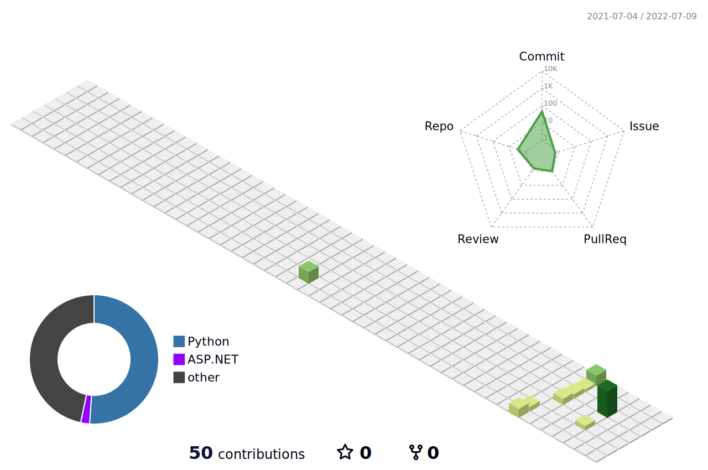

### Helloooooo><


<!--START_SECTION:waka-->


**🐱 My GitHub Data** 

> 🏆 32 Contributions in the Year 2022
 > 
> 📦 19.2 kB Used in GitHub's Storage 
 > 
> 🚫 Not Opted to Hire
 > 
> 📜 4 Public Repositories 
 > 
> 🔑 1 Private Repository 
 > 
**I'm a Night 🦉** 

```text
🌞 Morning    1 commits      ░░░░░░░░░░░░░░░░░░░░░░░░░   2.78% 
🌆 Daytime    12 commits     ████████░░░░░░░░░░░░░░░░░   33.33% 
🌃 Evening    19 commits     █████████████░░░░░░░░░░░░   52.78% 
🌙 Night      4 commits      ██░░░░░░░░░░░░░░░░░░░░░░░   11.11%

```


📊 **This Week I Spent My Time On** 

```text
💬 Programming Languages: 
No Activity Tracked This Week

```


 Last Updated on 14/06/2022 11:45:10 UTC
<!--END_SECTION:waka-->


<!--
**tsukiii-yue/tsukiii-yue** is a ✨ _special_ ✨ repository because its `README.md` (this file) appears on your GitHub profile.

Here are some ideas to get you started:

- 🔭 I’m currently working on ...
- 🌱 I’m currently learning ...
- 👯 I’m looking to collaborate on ...
- 🤔 I’m looking for help with ...
- 💬 Ask me about ...
- 📫 How to reach me: ...
- 😄 Pronouns: ...
- ⚡ Fun fact: ...
-->
