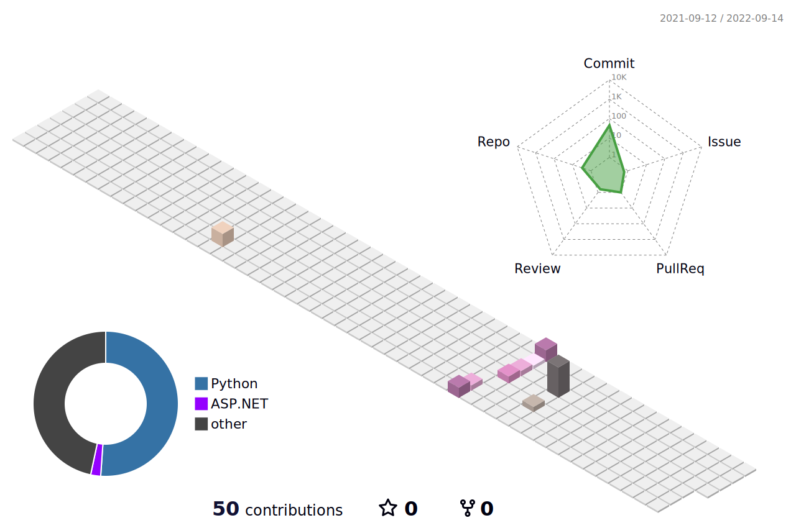

### Helloooooo><


<!--START_SECTION:waka-->


**🐱 My GitHub Data** 

> 🏆 43 Contributions in the Year 2022
 > 
> 📦 21.3 kB Used in GitHub's Storage 
 > 
> 🚫 Not Opted to Hire
 > 
> 📜 3 Public Repositories 
 > 
> 🔑 3 Private Repositories  
 > 
**I'm a Night 🦉** 

```text
🌞 Morning    1 commits      ░░░░░░░░░░░░░░░░░░░░░░░░░   1.92% 
🌆 Daytime    18 commits     ████████░░░░░░░░░░░░░░░░░   34.62% 
🌃 Evening    29 commits     ██████████████░░░░░░░░░░░   55.77% 
🌙 Night      4 commits      ██░░░░░░░░░░░░░░░░░░░░░░░   7.69%

```


📊 **This Week I Spent My Time On** 

```text
💬 Programming Languages: 
Other                    14 hrs 15 mins      █████████████████████████   100.0%

🔥 Editors: 
Browser                  14 hrs 15 mins      █████████████████████████   100.0%

```


 Last Updated on 16/07/2022 02:02:48 UTC
<!--END_SECTION:waka-->


<!--
**tsukiii-yue/tsukiii-yue** is a ✨ _special_ ✨ repository because its `README.md` (this file) appears on your GitHub profile.

Here are some ideas to get you started:

- 🔭 I’m currently working on ...
- 🌱 I’m currently learning ...
- 👯 I’m looking to collaborate on ...
- 🤔 I’m looking for help with ...
- 💬 Ask me about ...
- 📫 How to reach me: ...
- 😄 Pronouns: ...
- ⚡ Fun fact: ...
-->
